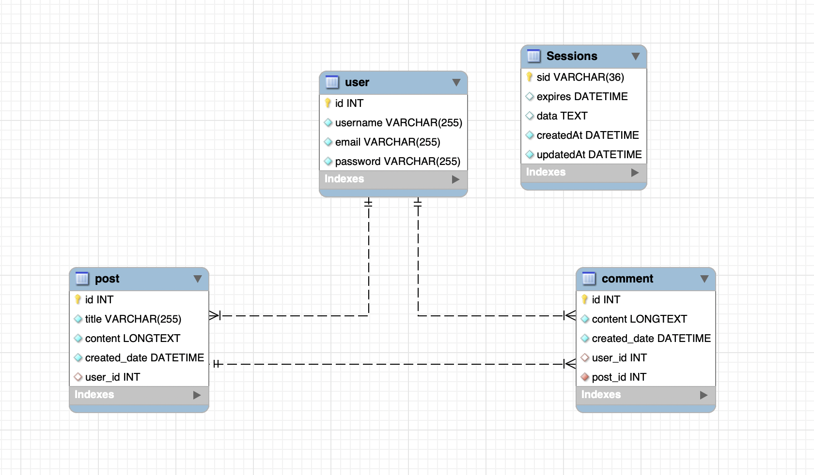
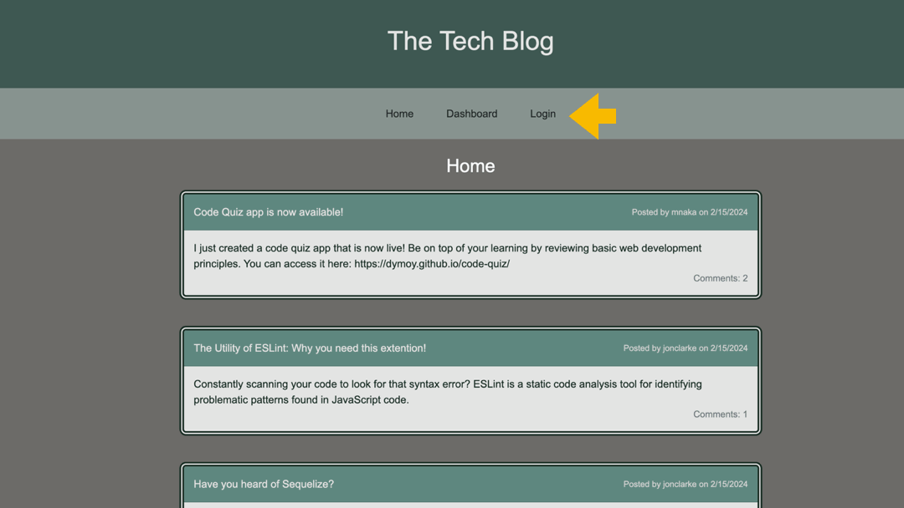

# MVC Tech Blog

## Description 

This web tool is a CMS-style tech blog where developers can publish their blog posts and comment on other developers' posts.

The goal of this project is to build an application that follows the MVC paradigm in its architectural structure, using Handlebars.js as the templating language, Sequelize as the ORM, and the express-session npm package for authentication

This project defines 4 Sequelize models: 
1. `User`
2. `Post`
3. `Comment`

The database is mapped according to the following schema:  

## Table of Contents 
- [Installation](#installation)
- [Dependencies](#dependencies)
- [Usage](#usage)
- [Testing](#testing)
- [Contributing](#contributing)
- [License](#license)
- [Questions](#questions)
  
## Installation 

There is no installation necessary as it is deployed to Heroku. You can visit the deployed application [here](https://dymoy-mvc-tech-blog-f7331d8522c8.herokuapp.com/) and try it out! 

If you would like to run the application locally, use the following steps:
1. Clone this repository to your local machine. (For reference, visit the [Cloning a Repository](https://docs.github.com/en/repositories/creating-and-managing-repositories/cloning-a-repository) GitHub Docs article.)
2. Run `npm install` in your CLI to download the npm package dependencies. 
3. Run `mysql -uroot -p` in your CLI and log into MySQL.
4. Run `source db/schema.sql` to create the database on your local machine.
5. Exit out of MySQL by running `exit`.
6. Run `npm run seed` in the root directory to seed the database.
7. Run `npm run start` to sync the Sequelize models to the MySQL database and start the server.
8. Open `http://localhost:3001` in your local browser. 
  
## Dependencies
This project requires the following npm package dependencies:
1. [bcrypt](https://www.npmjs.com/package/bcrypt)
2. [connect-session-sequelize](https://www.npmjs.com/package/connect-session-sequelize)
3. [dotenv](https://www.npmjs.com/package/dotenv)
4. [express](https://www.npmjs.com/package/express)
5. [express-handlebars](https://www.npmjs.com/package/express-handlebars)
6. [express-session](https://www.npmjs.com/package/express-session)
7. [mysql2](https://www.npmjs.com/package/mysql2)
8. [sequelize](https://www.npmjs.com/package/sequelize)

## Usage 

The animation gif below demonstrates the app's functionality:  
  

### Home Page Usage
- When the user opens the web app, they will be presented with the homepage that displays all existings posts. 
- Clicking on a post in the Home page will expand it to show existing comments for the post in question. 
    - The user will not be able to post a comment if they are not logged in.
- The navigation buttons for 'Dashboard' and 'Login' will redirect the user to the login page if there is no active session for them. 

### Dashboard Page Usage 
- When logged in, the Dashboard page will display all the user's existing blog posts
- A button will be displayed at the top to add a New Post
    - The new post will not be created if the Title and Content fields are empty 
    - Once the new post is created, they will be navigated back to their dashboard where their new post will appear 
- Clicking on a post in the dashboard page will allow the user to update or delete the post in question

### Login and Sign Up Page Usage 
- The user will have the option to login if they already have an account, or press the `Sign Up Instead` to create an account. 
- Once signed in, the user will be redirected to their Dashboard page, where they can create posts.

## Testing 
No test suites have been written for this application. The API routes were tested locally during development with the [Insomnia](https://docs.insomnia.rest/) development platform.  

Please refer to the [Installation](#installation) section if you are interested in running and testing the application locally.

## Contributing
To make contributions to this project:  
1. Fork the repository  
2. Make some commits to improve the application
3. Open a Pull Request on GitHub
4. From there, we can discuss your changes and merge the pull request once your contributions have been approved!

## License 
This GitHub repository is licensed under the MIT license. Please refer to the license documentation [here](https://opensource.org/licenses/MIT).
  
## Questions
This project was developed by [dymoy](https://github.com/dymoy).  
For any related questions, please contact me via email at <derekymoy@gmail.com>.